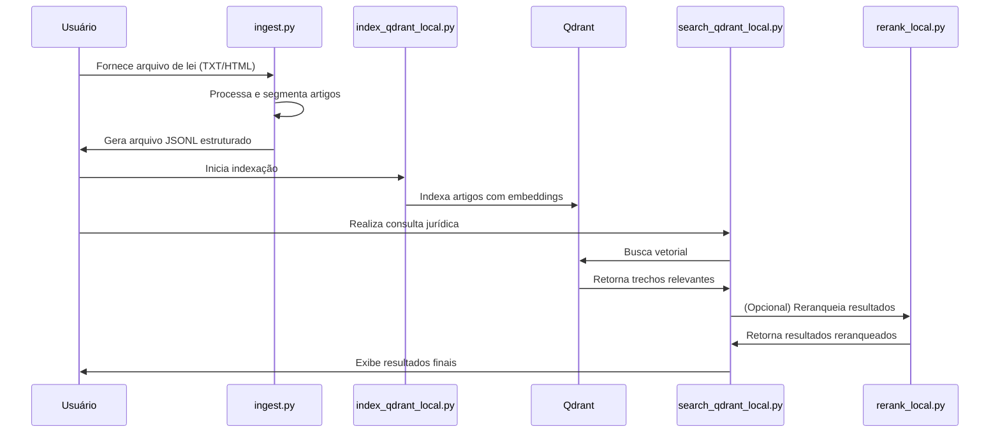
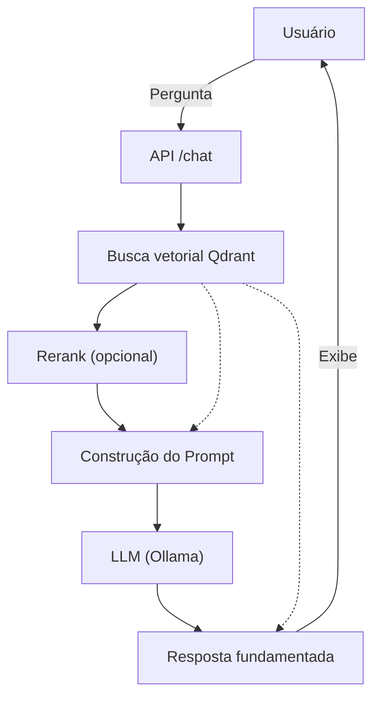
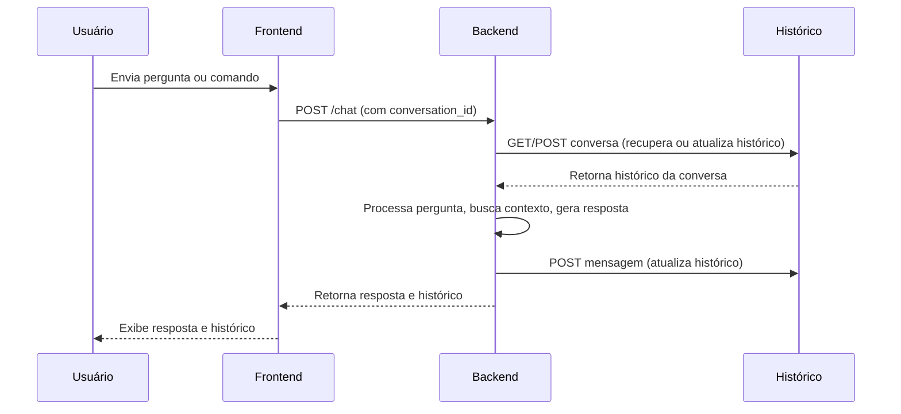

# Direito ao Ponto

O projeto buscar desenvolver um sistema de interpretração de linguagem natural e responder ao usuários com respostas objetivas e concretas sobre assuntos jurídicos, evitanto alucinações e sempre se baseando em uma arquitetura modular voltada tanto para um serviço on-premisse ou um serviço em nuvem.

Para a sua utilização são necessários três repositórios atual, onde o presente repositório se resume em ser a ponte entre os outros dois serviços, o frontend para interface com usuário e o history que salva o registro das conversas para utilizar no contexto das conversas e devolver respostas que fação sentido no contexto atual da conversa.

1. [Repositório resonpsável pelas conversas;](https://github.com/MaffezzoIIi/legal-assistant-history)
2. [Repositório do frontend](https://github.com/MaffezzoIIi/direito-ao-ponto-frontend)

## 🏛️ Tratamento dos dados jurídicos

O tratamento dos dados jurídicos é realizado por meio de uma sequência de scripts que processam, indexam e permitem a busca eficiente sobre textos legais. O fluxo típico envolve:

1. **Ingestão dos dados:** O script `ingest.py` lê arquivos brutos de leis (TXT ou HTML) e os transforma em arquivos JSONL estruturados, segmentando os textos em artigos ou trechos relevantes.

2. **Indexação dos dados:** O script `index_qdrant_local.py` consome o arquivo JSONL gerado e realiza a indexação dos textos em um banco vetorial (Qdrant), utilizando embeddings para facilitar buscas semânticas.

3. **Busca vetorial:** O script `search_qdrant_local.py` permite realizar buscas semânticas sobre os dados indexados, retornando os trechos mais relevantes para uma consulta jurídica.

4. **Reranqueamento (opcional):** Para maior precisão, o script `rerank_local.py` pode ser utilizado para reranquear os resultados da busca, usando modelos de cross-encoder.

> [Qdrant](https://qdrant.tech/)  
> [Vector database](https://en.wikipedia.org/wiki/Vector_database)

Diagrama de Sequência (Mermaid)



## 🏄‍♂️ Utilização do RAG + Ollama (LLM)

O sistema utiliza uma abordagem RAG (Retrieval-Augmented Generation) combinada com um modelo de linguagem local (Ollama) para gerar respostas jurídicas fundamentadas e contextualizadas. O fluxo consiste em:

1. **Recepção da pergunta do usuário**
2. **Recuperação de contexto**: Busca vetorial em Qdrant para encontrar trechos legais relevantes à consulta
3. **Reranqueamento**: (opcional) Melhora a precisão dos resultados usando modelo cross-encoder
4. **Construção do prompt**: Os trechos recuperados são formatados e inseridos em um prompt jurídico
5. **Geração da resposta**: O prompt é enviado ao modelo LLM (Ollama), que gera uma resposta fundamentada
6. **Retorno ao usuário**: A resposta é entregue junto com as citações legais utilizadas

### Diagrama de Arquitetura (Mermaid)



### Exemplo de fluxo

1. Usuário envia uma pergunta jurídica via endpoint `/chat`.
2. O backend recupera trechos relevantes usando busca vetorial.
3. (Opcional) Aplica rerank para priorizar os melhores trechos.
4. Monta um prompt com o contexto legal e a pergunta do usuário.
5. O Ollama gera uma resposta fundamentada, citando os artigos recuperados.
6. O sistema retorna a resposta e as citações ao usuário.

Esse fluxo garante que as respostas sejam sempre baseadas em fontes legais indexadas, reduzindo alucinações e aumentando a confiabilidade do sistema.

> [RAG](https://en.wikipedia.org/wiki/Retrieval-augmented_generation)  

## 🚀 Modo de Conversa Multi-turn

O endpoint `/chat` agora suporta conversas persistentes em memória. Cada requisição pode conter um `conversation_id` para continuar o histórico.

### Request

```bash
POST /chat
{
  "conversation_id": "<opcional>",
  "message": "Qual é o objetivo da recuperação judicial?",
  "use_llm": true,
  "k": 12,
  "max_history": 8
}
```

Se `conversation_id` não for enviado, o backend cria um novo e retorna no payload.

### Response

```json
{
  "answer": "...",
  "citations": ["Lei 11.101 art. 47", "Lei 11.101 art. 51"],
  "conversation_id": "b2f1e7c8d8e94b7a9d4c1e0d4c2f8a7b",
  "messages": [
    {"role": "user", "content": "Qual é o objetivo da recuperação judicial?"},
    {"role": "assistant", "content": "..."}
  ]
}
```

### Estratégia de Histórico

O motor de busca considera as últimas `max_history` mensagens do usuário para criar uma consulta combinada. O histórico completo é mantido até 50 mensagens (limite configurado em memória).

Para produzir uma conversa de verdade no frontend, basta reutilizar o `conversation_id` retornado e exibir o array `messages` em formato de chat.

## Como rodar (dev)

```bash
python -m venv .venv
".venv\\Scripts\\activate"  # PowerShell Windows
pip install -r requirements.txt
uvicorn app.main:app --reload --port 8000
```

### Documentação OpenAPI/Swagger

O FastAPI gera automaticamente a documentação dos endpoints em formato OpenAPI. Para visualizar e testar os endpoints, basta acessar:

- [http://localhost:8000/docs](http://localhost:8000/docs) — Interface interativa Swagger UI
- [http://localhost:8000/openapi.json](http://localhost:8000/openapi.json) — Arquivo OpenAPI em JSON

Esses caminhos funcionam por padrão ao rodar o backend com FastAPI/Uvicorn. Não é necessário configuração extra.

> [FastAPI](https://fastapi.tiangolo.com/)  
> [Swagger](https://swagger.io/)

## 📦 Stack Local (Embeddings + Rerank)

Fluxo típico para adicionar uma nova lei usando somente recursos locais:

```bash
# 1. Ingestão (gera JSONL processado de artigos/chunks)
python -m scripts.ingest --lei "11.101/2005" --input data/raw/lei_11101_2005.txt

# (Opcional) baixar via URL oficial:
python -m scripts.ingest --lei "11.101/2005" --url "https://www.planalto.gov.br/..." --output data/processed/lei_11101_2005.jsonl --raw-html-out data/raw/lei_11101_2005.html

# 2. Indexação local (embeddings CPU)
python -m scripts.index_qdrant_local --jsonl data/processed/lei_11101_2005.jsonl --collection leis --recreate

# 3. Busca vetorial simples
python -m scripts.search_qdrant_local --query "plano de recuperação judicial" --k 8

# 4. Busca + rerank (melhor precisão)
python -m scripts.search_qdrant_local --query "plano de recuperação judicial" --k 12 --n 5 --rerank
```

Variáveis úteis:

```text
EMBED_MODEL=intfloat/multilingual-e5-base   # mudar modelo de embeddings
RERANK_MODEL=BAAI/bge-reranker-v2-m3        # mudar modelo cross-encoder
QDRANT_COLLECTION=leis                      # nome da collection
QDRANT_HOST=localhost QDRANT_PORT=6333      # endpoint Qdrant
```

Para ver todos os resultados antes do rerank final: `--show-all`.

## 🧠 Geração de Documento com IA (Petição Inicial de Cobrança)

Além de preencher manualmente os campos do JSON para o endpoint de documento, você pode gerar seções automaticamente (fatos, pedidos, provas) usando recuperação + LLM local (Ollama).

### Pré-requisitos

1. Qdrant rodando local e já indexado (ver seção anterior).
2. Ollama instalado e modelo carregado (ex.: `ollama pull llama3.1:8b`).
3. Variáveis de ambiente (opcionais):
   - `OLLAMA_HOST` (default `http://localhost:11434`)
   - `OLLAMA_MODEL` (ex.: `llama3.1:8b`)

### Função Python

A função `generate_peticao_inicial_cobranca_ai` em `app/documents/generator.py`:

- Recupera artigos relevantes da coleção (embeddings locais)
- Gera texto estruturado para fatos / pedidos / provas se estiverem vazios ou se `force=True`
- Renderiza o template `.docx` final

```python
from app.documents.generator import generate_peticao_inicial_cobranca_ai

entrada = {
  "foro": "Foro Central da Comarca X",
  "autor": {"nome": "João Silva", "cpf": "123.456.789-00", "endereco": "Rua A, 100"},
  "reu": {"nome": "Empresa Y Ltda.", "cnpj": "12.345.678/0001-99", "endereco": "Av. B, 200"},
  "valor_causa": 15000.00,
  # campos fatos/pedidos/provas vazios => serão gerados
}

doc_path = generate_peticao_inicial_cobranca_ai(
  entrada,
  consulta_caso="Cliente não recebeu valores de contrato de prestação de serviços firmado em 2023.",
  k=12,            # número de chunks recuperados
  n_context=6,     # reservado para futura lógica (rerank)
  force=False      # True para sobrescrever se já houver conteúdo
)
print("Gerado:", doc_path)
```

### Como funciona internamente

1. Normaliza a descrição do caso com `preprocess_question`.
2. Busca vetorial em Qdrant (`k` resultados).
3. Monta o CONTEXTO concatenando trechos (truncados para ~900 chars cada).
4. Chama o Ollama usando um prompt jurídico padronizado (cita artigos se possível).
5. Para `pedidos` e `provas`, transforma a resposta em lista de itens por linha.
6. Renderiza docx final com `docxtpl`.

### Dicas de Prompt

- Forneça contexto factual claro em `consulta_caso`.
- Ajuste `k` se vier pouco fundamento legal (maior recall).
- Se a saída vier prolixa, considere reduzir o modelo ou pós-processar (ex.: limitar número de linhas em pedidos).

### Possíveis Extensões

- Reranqueamento dos artigos antes da geração (usar `rerank_local.py`).
- Geração de fundamentação jurídica e jurisprudência em seções separadas.
- Verificação automática de citações legais (regex para "Art.").

## Arquitetura: Frontend, Backend e Serviço de Histórico

### O sistema é composto por três principais componentes

1. **Frontend**
Interface web utilizada pelo usuário para enviar perguntas jurídicas, visualizar respostas e acompanhar o histórico de conversas.

2. **Backend (Legal Assistant)**
API central que recebe as requisições do frontend, processa perguntas, realiza busca semântica, gera respostas fundamentadas e interage com o serviço de histórico para registrar e recuperar conversas.

3. **Serviço de Histórico**
Microserviço responsável por armazenar e recuperar o histórico das conversas dos usuários, permitindo persistência e contexto em múltiplos turnos.

Fluxo de Interação
O usuário interage com o frontend, enviando perguntas ou comandos.
O frontend faz requisições HTTP para o backend (ex: `/chat`, `/conversation/{id}`).
O backend processa a requisição, consulta o serviço de histórico para obter ou atualizar o contexto da conversa.
O backend realiza busca semântica, gera resposta (usando RAG + LLM local) e retorna ao frontend.
O frontend exibe a resposta e o histórico atualizado ao usuário.



[Vídeo demonstrativo](https://youtu.be/FMrRUNGxe1Y)
