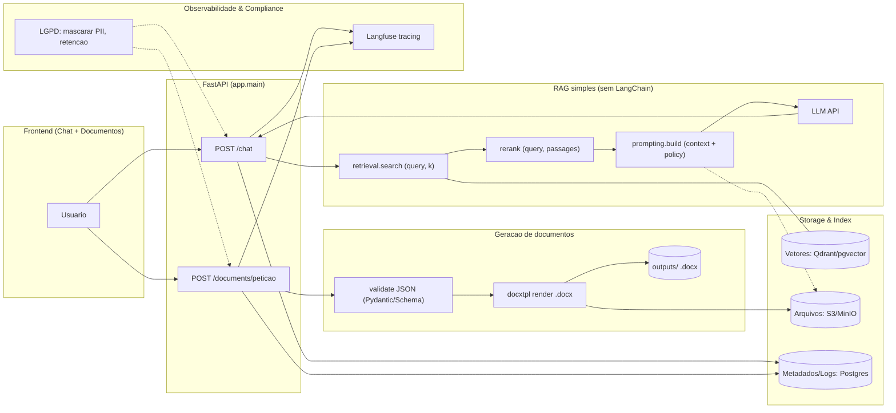
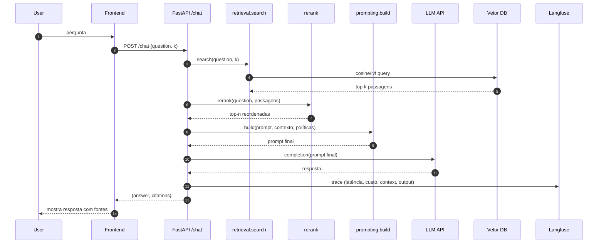
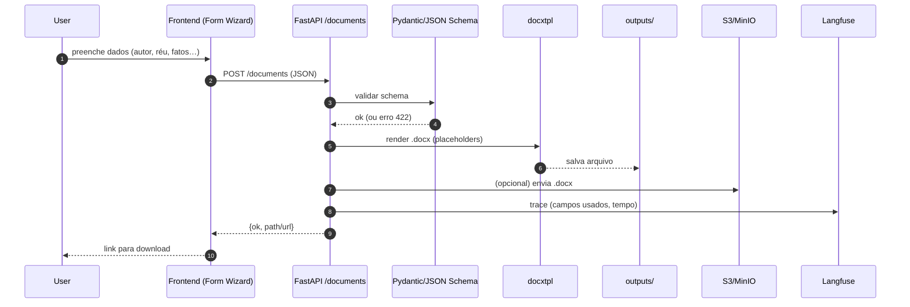

```mermaid
flowchart LR
  subgraph Client["Frontend (Chat + Documentos)"]
    UQ["Usuario"]
  end

  subgraph API["FastAPI (app.main)"]
    CH["POST /chat"]
    DOC["POST /documents/peticao"]
  end

  subgraph RAG["RAG simples (sem LangChain)"]
    R1["retrieval.search (query, k)"]
    R2["rerank (query, passages)"]
    R3["prompting.build (context + policy)"]
    LLM["LLM API"]
  end

  subgraph Docs["Geracao de documentos"]
    V1["validate JSON (Pydantic/Schema)"]
    TPL["docxtpl render .docx"]
    OUT[("outputs/ .docx")]
  end

  subgraph Data["Storage & Index"]
    VDB[("Vetores: Qdrant/pgvector")]
    S3[("Arquivos: S3/MinIO")]
    PG[("Metadados/Logs: Postgres")]
  end

  subgraph Obs["Observabilidade & Compliance"]
    LF["Langfuse tracing"]
    LG["LGPD: mascarar PII, retencao"]
  end

  UQ --> CH
  CH --> R1 --> R2 --> R3 --> LLM --> CH
  CH --> LF
  R1 --- VDB
  R3 -.-> S3
  CH --> PG

  UQ --> DOC --> V1 --> TPL --> OUT
  TPL --> S3
  DOC --> LF
  DOC --> PG
  LG -.-> CH
  LG -.-> DOC
```

```mermaid
sequenceDiagram
  autonumber
  participant User
  participant FE as Frontend
  participant API as FastAPI /chat
  participant RET as retrieval.search
  participant RR as rerank
  participant PR as prompting.build
  participant LLM as LLM API
  participant VDB as Vetor DB
  participant LF as Langfuse

  User->>FE: pergunta
  FE->>API: POST /chat {question, k}
  API->>RET: search(question, k)
  RET->>VDB: cosine/ivf query
  VDB-->>RET: top-k passagens
  API->>RR: rerank(question, passagens)
  RR-->>API: top-n reordenadas
  API->>PR: build(prompt, contexto, políticas)
  PR-->>API: prompt final
  API->>LLM: completion(prompt final)
  LLM-->>API: resposta
  API->>LF: trace (latência, custo, context, output)
  API-->>FE: {answer, citations}
  FE-->>User: mostra resposta com fontes

```

```mermaid
sequenceDiagram
  autonumber
  participant User
  participant FE as Frontend (Form Wizard)
  participant API as FastAPI /documents
  participant VAL as Pydantic/JSON Schema
  participant TPL as docxtpl
  participant OUT as outputs/
  participant S3 as S3/MinIO
  participant LF as Langfuse

  User->>FE: preenche dados (autor, réu, fatos…)
  FE->>API: POST /documents (JSON)
  API->>VAL: validar schema
  VAL-->>API: ok (ou erro 422)
  API->>TPL: render .docx (placeholders)
  TPL-->>OUT: salva arquivo
  API->>S3: (opcional) envia .docx
  API->>LF: trace (campos usados, tempo)
  API-->>FE: {ok, path/url}
  FE-->>User: link para download

```
